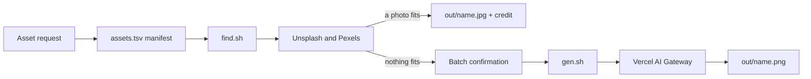

<p align="center">
  
</p>

<p align="center"><strong>A real photo when one fits. A generated image when none does.</strong></p>

<p align="center">
  
  
  
</p>

Asset Foundry is a small, controlled workflow for image assets. You define assets in a tab-separated manifest. One script searches [Unsplash](https://unsplash.com) and [Pexels](https://www.pexels.com) for a free real photo and records its credit. A second script generates the assets that no photo fits, with `openai/gpt-image-2` through [Vercel AI Gateway](https://vercel.com/ai-gateway), after you approve that paid batch.

## Why Asset Foundry

A real photo usually beats a generated one, and it is free. When nothing real fits, one well-written generation call beats a round of drafts. Asset Foundry makes each requested asset explicit and repeatable.

- The manifest records the name, ratio, references, and prompt.
- A search runs before any paid call. A taken photo keeps its credit and license.
- The batch defines the paid-call boundary before generation starts.
- Generation uses one model at high quality. There is no draft route.
- Existing outputs are skipped.
- A failed generation stops the batch.
- The workflow never retries automatically.

## Pipeline



## Quick start

Prerequisites: Bash, `curl`, `jq`, a current Node.js runtime, `ai-cli@0.4.3`, a Vercel AI Gateway key, and a free Unsplash or Pexels key.

1. Clone the repository.

   ```sh
   git clone https://github.com/VortiMedia/asset-foundry.git
   cd asset-foundry
   ```

2. Install the pinned CLI.

   ```sh
   npm install --global ai-cli@0.4.3
   ai --version
   ```

3. Create the local environment file.

   ```sh
   cp .env.example .env
   ```

4. Put a spend-capped gateway key and the free library keys in `.env`.

   ```dotenv
   AI_GATEWAY_API_KEY=your_gateway_key
   UNSPLASH_ACCESS_KEY=your_unsplash_access_key
   PEXELS_API_KEY=your_pexels_key
   ```

Do not commit `.env`. Asset Foundry does not require a direct provider key.

## First asset

Inspect the example manifest. Then replace or add a row for the asset that you want to create.

```tsv
# name	ratio	refs	prompt
ceramic-vessel-study	1:1	-	Single handmade ceramic vessel on a warm white studio sweep, soft side light, editorial product photograph, no text
```

Search for a real photo first. The search is free.

```sh
./find.sh ceramic-vessel-study handmade ceramic vase
```

Look at the previews in `out/candidates/ceramic-vessel-study/`. If one fits, take it:

```sh
./find.sh --take ceramic-vessel-study unsplash-aB1c2D3
```

The output is `out/ceramic-vessel-study.jpg`, with its credit and license in `out/ceramic-vessel-study.credit.tsv`.

If no photo fits, confirm the asset name and paid-call count. Then generate it:

```sh
./gen.sh ceramic-vessel-study
```

Expected result:

```text
made ceramic-vessel-study
```

The output is `out/ceramic-vessel-study.png`. If a PNG or a taken JPEG already exists, the script prints `skip ceramic-vessel-study` and makes no paid call.

Use `./gen.sh --all` only when you intend to generate every missing manifest asset.

## Model

Generation uses `openai/gpt-image-2` at high quality with an explicit pixel size. There is no model option and no draft route. Write the prompt with the structure in [`prompts/recipes.md`](prompts/recipes.md) so that one call gives the final asset.

## Operating guarantees

**Real photo first.** A free search runs before any paid call. A taken photo records its photographer, source page, and license in a credit file. Unsplash downloads are counted through the Unsplash download endpoint.

**Cost control.** The operator confirms a batch before generation. The script generates only named rows, unless the operator explicitly uses `--all`. It skips an existing output, including a taken photo.

**Secret handling.** The secrets are `AI_GATEWAY_API_KEY`, `UNSPLASH_ACCESS_KEY`, and `PEXELS_API_KEY`. The local `.env` file is ignored. Agent permissions deny access to `.env`.

**Reference order.** The script sends comma-separated references from left to right. In a two-pass edit, list the clean base output first and the approved reference second.

**Failure behavior.** The script reads the manifest from top to bottom. It uses zero-byte standard input, disables preview output, and stops on the first failed generation. A search names a library that failed and exits nonzero. No script retries.

## Repository map

| Path | Purpose |
| --- | --- |
| [`assets.tsv`](assets.tsv) | Four-column asset manifest |
| [`find.sh`](find.sh) | Free photo search and take |
| [`gen.sh`](gen.sh) | Controlled generation entry point |
| [`tests/run.sh`](tests/run.sh) | Offline tests with fake `curl` and `ai` |
| [`AGENTS.md`](AGENTS.md) | Canonical agent guardrails |
| [`brand/`](brand/README.md) | Ignored private reference area |
| [`prompts/recipes.md`](prompts/recipes.md) | Reusable prompt patterns |
| [`docs/getting-started.md`](docs/getting-started.md) | Setup and first asset |
| [`docs/operator-guide.md`](docs/operator-guide.md) | Daily operating workflow |
| [`docs/architecture.md`](docs/architecture.md) | Components and trust boundaries |
| [`docs/reference.md`](docs/reference.md) | Commands and exact behavior |

## Documentation style

The documentation uses active voice, short procedures, and consistent terms. This style is inspired by [ASD Simplified Technical English](https://www.asd-ste100.org/about_STE.html). Asset Foundry does not claim ASD-STE100 compliance, certification, or affiliation.

See [Getting started](docs/getting-started.md) for setup. See the [Operator guide](docs/operator-guide.md) before you run a paid batch.

## License

[MIT](LICENSE) © 2026 VortiMedia
