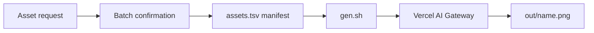

<p align="center">
  
</p>

<p align="center"><strong>Controlled image generation, from manifest to approved asset.</strong></p>

<p align="center">
  
  
  
</p>

Asset Foundry is a small, controlled workflow for image generation. You define assets in a tab-separated manifest. You approve a batch. One script sends only that batch through [Vercel AI Gateway](https://vercel.com/ai-gateway). The script writes each result to an ignored output directory.

## Why Asset Foundry

Image generation becomes difficult to review when prompts, model choices, and outputs live in chat history. Asset Foundry makes each requested asset explicit and repeatable.

- The manifest records the name, ratio, references, and prompt.
- The batch defines the paid-call boundary before generation starts.
- The script accepts two model IDs and one gateway secret.
- Existing outputs are skipped.
- A failed generation stops the batch.
- The workflow never retries automatically.

## Pipeline



## Quick start

Prerequisites: Bash, a current Node.js runtime, `ai-cli@0.4.3`, and a Vercel AI Gateway key.

1. Clone the repository.

   ```sh
   git clone https://github.com/VortiMedia/asset-foundry.git
   cd asset-foundry
   ```

2. Install the pinned CLI.

   ```sh
   npm install --global ai-cli@0.4.3
   ai --version
   ```

3. Create the local environment file.

   ```sh
   cp .env.example .env
   ```

4. Put a spend-capped gateway key in `.env`.

   ```dotenv
   AI_GATEWAY_API_KEY=your_gateway_key
   ```

Do not commit `.env`. Asset Foundry does not require a direct provider key.

## First generation

Inspect the example manifest. Then replace or add a row for the asset that you want to create.

```tsv
# name	ratio	refs	prompt
ceramic-vessel-study	1:1	-	Single handmade ceramic vessel on a warm white studio sweep, soft side light, editorial product photograph, no text
```

Confirm the asset name and paid-call count before you run the command.

```sh
./gen.sh ceramic-vessel-study
```

Expected result:

```text
made ceramic-vessel-study
```

The output is `out/ceramic-vessel-study.png`. If that file already exists, the script prints `skip ceramic-vessel-study` and makes no paid call.

Use `./gen.sh --all` only when you intend to generate every missing manifest asset.

## Model selection

The default model is the final-quality route:

```sh
./gen.sh ceramic-vessel-study
```

Use the draft route when you need an inexpensive composition check:

```sh
MODEL=google/gemini-3.1-flash-image ./gen.sh ceramic-vessel-study
```

| Model ID | Role | Script behavior |
| --- | --- | --- |
| `openai/gpt-image-2` | Final | Uses high quality and an explicit pixel size |
| `google/gemini-3.1-flash-image` | Draft | Uses the manifest aspect ratio and no quality option |

All other model IDs fail before generation starts.

## Operating guarantees

**Cost control.** The operator confirms a batch before generation. The script generates only named rows, unless the operator explicitly uses `--all`. It skips an existing output.

**Secret handling.** `AI_GATEWAY_API_KEY` is the only secret. The local `.env` file is ignored. Agent permissions deny access to `.env`.

**Reference order.** The script sends comma-separated references from left to right. In a two-pass edit, list the clean base output first and the approved reference second.

**Failure behavior.** The script reads the manifest from top to bottom. It uses zero-byte standard input, disables preview output, and stops on the first failed generation. It does not retry.

## Repository map

| Path | Purpose |
| --- | --- |
| [`assets.tsv`](assets.tsv) | Four-column asset manifest |
| [`gen.sh`](gen.sh) | Controlled generation entry point |
| [`AGENTS.md`](AGENTS.md) | Canonical agent guardrails |
| [`CLAUDE.md`](CLAUDE.md) | Claude Code instruction import |
| [`.claude/settings.json`](.claude/settings.json) | Narrow project permissions |
| [`brand/`](brand/README.md) | Ignored private reference area |
| [`prompts/recipes.md`](prompts/recipes.md) | Reusable prompt patterns |
| [`docs/getting-started.md`](docs/getting-started.md) | Setup and first asset |
| [`docs/operator-guide.md`](docs/operator-guide.md) | Daily operating workflow |
| [`docs/architecture.md`](docs/architecture.md) | Components and trust boundaries |
| [`docs/reference.md`](docs/reference.md) | Commands and exact behavior |

## Documentation style

The documentation uses active voice, short procedures, and consistent terms. This style is inspired by [ASD Simplified Technical English](https://www.asd-ste100.org/about_STE.html). Asset Foundry does not claim ASD-STE100 compliance, certification, or affiliation.

See [Getting started](docs/getting-started.md) for setup. See the [Operator guide](docs/operator-guide.md) before you run a paid batch.

## License

[MIT](LICENSE) © 2026 VortiMedia
