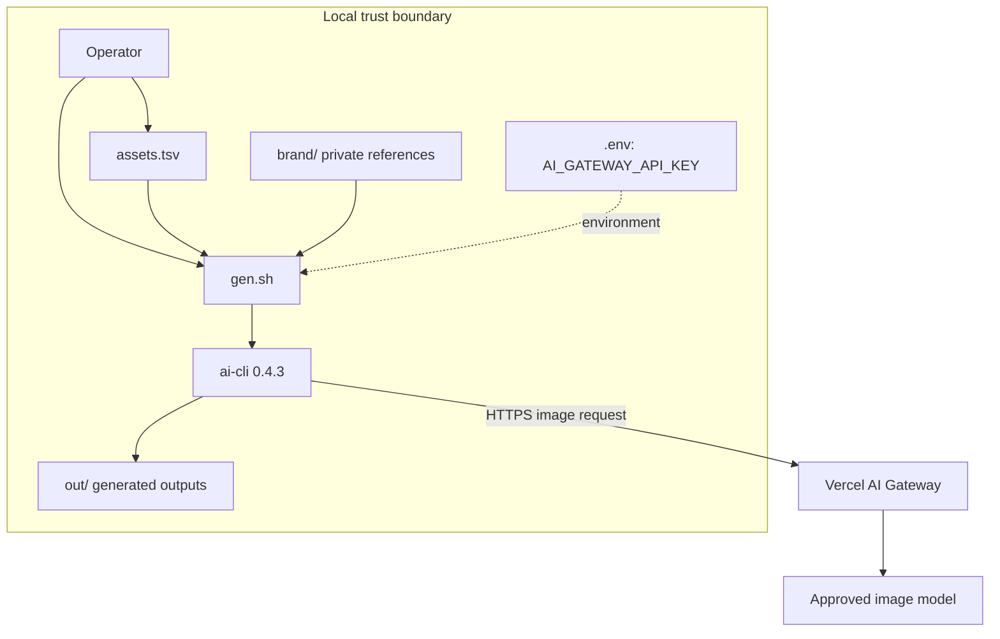
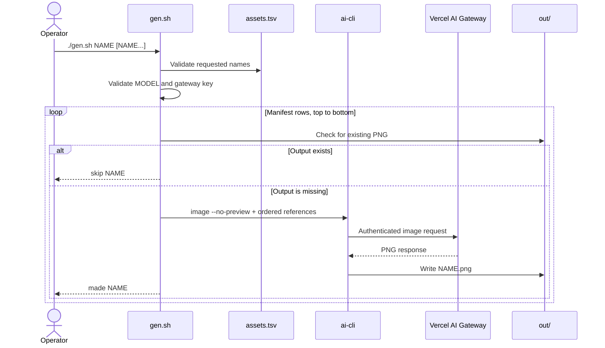

# Architecture

Asset Foundry has a small execution surface. The manifest controls intent. The shell script controls model routing and output behavior. Vercel AI Gateway controls provider access and spend limits.

## Components

| Component | Responsibility |
| --- | --- |
| Operator | Confirms the batch and paid-call estimate |
| `assets.tsv` | Stores asset definitions in manifest order |
| `gen.sh` | Validates input, selects rows, maps ratios, and invokes `ai` |
| `ai-cli` | Sends the image request to Vercel AI Gateway |
| Vercel AI Gateway | Authenticates, routes, and accounts for model use |
| `out/` | Stores ignored PNG outputs |
| `brand/` | Stores ignored private references |

## System architecture

## Trust boundaries

The local boundary contains the manifest, prompt text, references, gateway key, and outputs. Git tracks the manifest and instructions. Git ignores `.env`, `out/`, and private files in `brand/`.

The network boundary starts at `ai-cli`. A request can contain the prompt and ordered reference images. Vercel AI Gateway receives the gateway key and routes the request to the selected model.

Do not put a provider key in Asset Foundry. `AI_GATEWAY_API_KEY` is the only supported secret.

## Model routing

`MODEL` defaults to `openai/gpt-image-2`. The script accepts only these routes:

| Route | Image arguments |
| --- | --- |
| `openai/gpt-image-2` | `--size PIXELS --quality high` |
| `google/gemini-3.1-flash-image` | `--aspect-ratio RATIO` |

The allowlist fails closed. An unsupported model exits before the script reads the secret or invokes `ai`.

## Ratio mapping

| Manifest ratio | OpenAI size | Gemini argument |
| --- | --- | --- |
| `16:9` | `1536x864` | `16:9` |
| `3:2` | `1536x1024` | `3:2` |
| `1:1` | `1024x1024` | `1:1` |
| `4:5` | `1024x1280` | `4:5` |
| `9:16` | `864x1536` | `9:16` |

For the OpenAI route, an unsupported ratio exits when the script reaches that asset. For the Gemini route, the script passes the manifest ratio to the model CLI.

## Generation sequence

## Failure behavior

The script uses `set -euo pipefail`. It stops on the first command failure.

- No argument returns usage error `64`.
- An unknown asset or unsupported model returns `64`.
- An unsupported OpenAI ratio returns `65`.
- A missing `ai` command returns `69`.
- A missing gateway key returns `78`.
- An `ai` failure returns the nonzero status from `ai`.
- Earlier outputs remain after a later failure.
- Later manifest rows do not run after a failure.
- No code path retries a request.

The `ai` process receives zero-byte standard input. The `--no-preview` option prevents interactive preview behavior.

## Documentation note

This document uses a writing style inspired by ASD Simplified Technical English. It does not claim ASD-STE100 compliance, certification, or affiliation.
