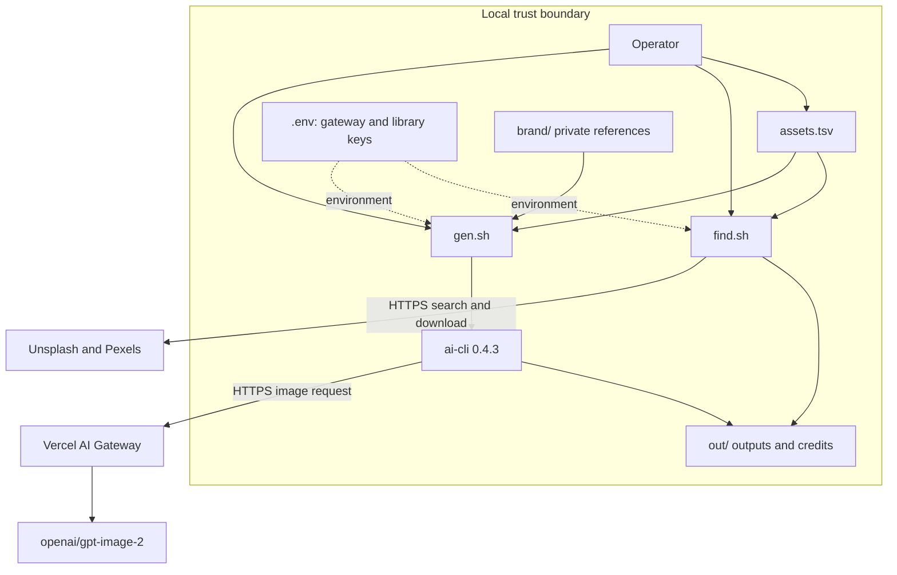
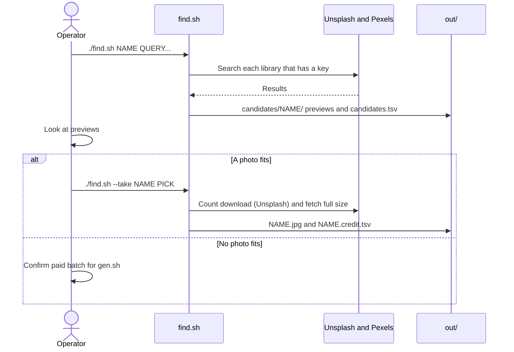
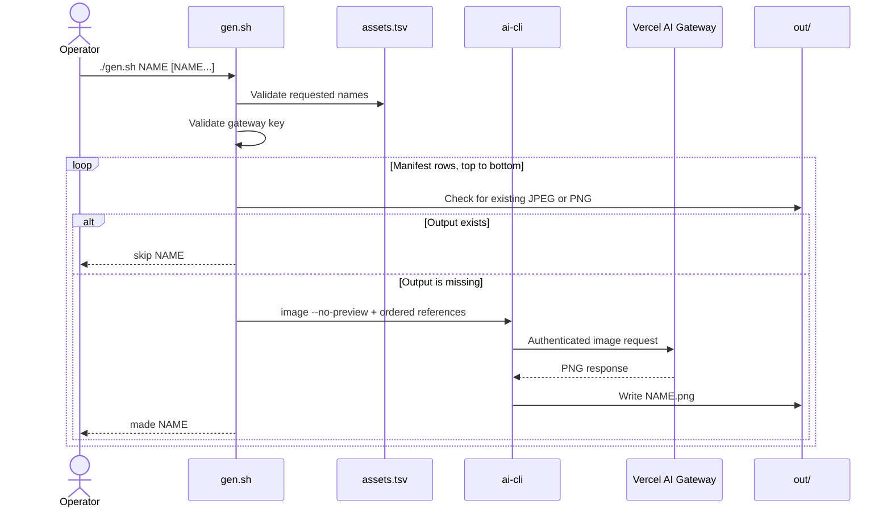

# Architecture

Asset Foundry has a small execution surface. The manifest controls intent. `find.sh` searches free photo libraries and takes a real photo. `gen.sh` generates an image only for an asset that has no photo. Vercel AI Gateway controls provider access and spend limits.

## Components

| Component | Responsibility |
| --- | --- |
| Operator | Chooses a candidate, or confirms the batch and paid-call estimate |
| `assets.tsv` | Stores asset definitions in manifest order |
| `find.sh` | Searches Unsplash and Pexels, saves previews, and takes one photo with its credit |
| Unsplash and Pexels APIs | Return free photos under their own licenses |
| `gen.sh` | Validates input, selects rows, maps ratios, and invokes `ai` |
| `ai-cli` | Sends the image request to Vercel AI Gateway |
| Vercel AI Gateway | Authenticates, routes, and accounts for model use |
| `out/` | Stores ignored outputs, credits, and candidate previews |
| `brand/` | Stores ignored private references |

## System architecture

## Trust boundaries

The local boundary contains the manifest, prompt text, references, keys, and outputs. Git tracks the manifest and instructions. Git ignores `.env`, `out/`, and private files in `brand/`.

The network boundary starts at `ai-cli`. A request can contain the prompt and ordered reference images. Vercel AI Gateway receives the gateway key and routes the request to the selected model.

A search sends only the query words and the orientation to the photo libraries. No prompt, reference, or output leaves the machine through `find.sh`.

Do not put an image-model provider key in Asset Foundry. The supported secrets are `AI_GATEWAY_API_KEY`, `UNSPLASH_ACCESS_KEY`, and `PEXELS_API_KEY`.

## Model routing

`gen.sh` uses one route: `openai/gpt-image-2` with `--size PIXELS --quality high`. There is no model option.

## Ratio mapping

| Manifest ratio | Generated size | Search orientation |
| --- | --- | --- |
| `16:9` | `1536x864` | Landscape |
| `3:2` | `1536x1024` | Landscape |
| `1:1` | `1024x1024` | Square |
| `4:5` | `1024x1280` | Portrait |
| `9:16` | `864x1536` | Portrait |

An unsupported ratio exits when a script reaches that asset.

## Search and take sequence

## Generation sequence

## Failure behavior

The script uses `set -euo pipefail`. It stops on the first command failure.

- No argument returns usage error `64`.
- An unknown asset returns `64`.
- An unsupported ratio returns `65`.
- A missing `ai` command returns `69`.
- A missing gateway key returns `78`.
- An `ai` failure returns the nonzero status from `ai`.
- Earlier outputs remain after a later failure.
- Later manifest rows do not run after a failure.
- No code path retries a request.

`find.sh` names a library that failed or has no key. It still lists results from the other library and then exits `75`. A take writes to a `.partial` file first, so a failed download leaves no output.

The `ai` process receives zero-byte standard input. The `--no-preview` option prevents interactive preview behavior.

## Documentation note

This document uses a writing style inspired by ASD Simplified Technical English. It does not claim ASD-STE100 compliance, certification, or affiliation.
